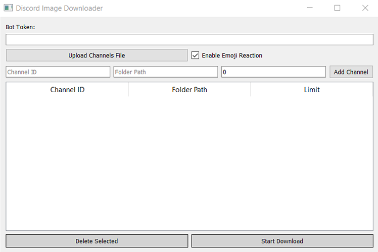
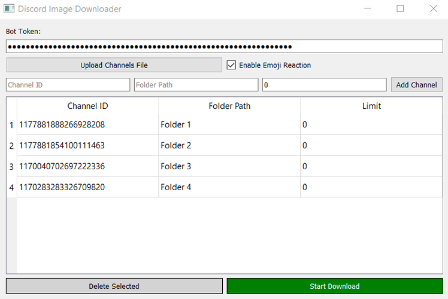

# Discord Image Downloader

Discord Image Downloader is a Python application that allows you to download images from specified Discord channels. It features a graphical user interface (GUI) for ease of use and provides options to specify channels, folders, and download limits.

## Features

- Download images from multiple Discord channels
- Specify download limits for each channel
- Add channels manually or upload a file with channel information
- Option to add emoji reactions to processed messages
- User-friendly GUI built with PyQt5

## Prerequisites

- Python 3.x
- Discord bot token with necessary permissions to read messages and add reactions
- Required Python packages

## Installation

1. **Clone the repository:**

    ```bash
    git clone https://github.com/Nafi7393/Discord-Image-Downlaoder-for-Midjourney.git
    cd Discord-Image-Downlaoder-for-Midjourney
    ```

2. **Install the required packages:**

    ```bash
    pip install -r requirements.txt
    ```

3. **Set up environment variables:**

    Create a `.env` file in the root directory and add your Discord bot token:

    ```env
    BOT_TOKEN=your_bot_token_here
    ```

## Usage

### Running the Application

Run the application using the following command:

```bash
python gui.py
```

### User Interface

#### Initial GUI Interface



1. **Bot Token:** Input your Discord bot token. The token will be masked for security.
2. **Upload Channels File:** Upload a text file containing channel information.
3. **Enable Emoji Reaction:** Check this box if you want the bot to add an emoji reaction to processed messages.
4. **Channel ID, Folder Path, and Limit:** Manually add channel details.
5. **Add Channel:** Add the channel information to the table.
6. **Channels Table:** Displays the list of channels, folder paths, and limits.
7. **Delete Selected:** Delete selected channels from the table.
8. **Start Download:** Start the image downloading process.

#### After Adding Channels List



### File Format for Upload

If you prefer to upload a channels file, it should be a text file formatted as follows:

```
BOT_TOKEN=your_bot_token_here
channel_id_1, folder_path_1
channel_id_2, folder_path_2
...
```

### Example Channels File

```text
BOT_TOKEN=your_bot_token_here
123456789012345678, /path/to/folder1
234567890123456789, /path/to/folder2
```

### GUI Operations

1. **Uploading Channels File:**

    - Click the `Upload Channels File` button and select your channels file.
    - The table will populate with the channel information from the file.
    - The bot token will be set automatically if included in the file.

2. **Adding Channels Manually:**

    - Enter the channel ID, folder path, and download limit in the respective input fields.
    - Click `Add Channel` to add the channel to the table.
    - Repeat the process for additional channels.

3. **Deleting Channels:**

    - Select the rows you want to delete in the table.
    - Click the `Delete Selected` button to remove them.

4. **Starting the Download:**

    - Ensure the bot token is entered and channels are listed in the table.
    - Click `Start Download` to begin the image downloading process.
    - The application will download images from the specified channels to the respective folders.

### Behind the Scenes

The application consists of two main parts:

1. **`main.py`:** Contains the `DiscordImageDownloader` class which handles the Discord bot operations and image downloading.

2. **`gui.py`:** Contains the `DownloaderGUI` class which handles the graphical user interface and interacts with the `DiscordImageDownloader`.

## Contributing

Feel free to submit issues or pull requests if you have any suggestions or improvements.
